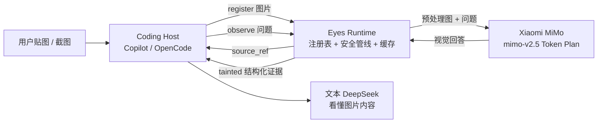

# DeepSeek Eyes 👀

> 给纯文本 DeepSeek 装上眼睛 —— 用小米 MiMo Token Plan 做视觉后端,让编程 Agent 真正看懂截图。

**English:** DeepSeek Eyes gives text-only DeepSeek coding agents real vision. Paste or capture a screenshot in Copilot / OpenCode, and the agent can actually *see* it: images register with a tamper-proof `source_ref`, the agent calls `deepseek_eyes_observe`, and the Xiaomi MiMo (`mimo-v2.5`) vision backend returns structured, tainted evidence the text agent can reason over. Windows-first, fully local, credentials never touch disk.

[](https://www.python.org/downloads/release/python-3120/)
[](LICENSE)

## 解决什么痛点

DeepSeek 系模型便宜、代码能力强,但**没有视觉输入**。在 Copilot / OpenCode 里贴一张 UI 报错截图,它只会说"我看不到图片"。于是:

- 前端报错截图 → 无法读 → 只能靠你逐字描述
- 设计稿对比、图表数据提取 → 全部失明
- 屏幕状态验证(游戏 / 桌面自动化)→ 完全不可能

DeepSeek Eyes 在本地架起一座桥:

1. 你在宿主里贴图 / 截图 → 图片自动注册,Agent 拿到**不可伪造的 `source_ref`**
2. Agent 需要"看"时调 `deepseek_eyes_observe` → 图片经安全管线交给 MiMo(`mimo-v2.5`)
3. MiMo 的视觉结果以**带污染标记的结构化证据**返回,文本 Agent 正常理解

从此,UI 报错截图、设计稿对比、图表数据提取、屏幕状态验证 —— 纯文本 Agent 全部能读。

## 特性

### 👁 核心视觉链路

- **register → observe → tainted evidence**:显式注册、精确缓存、single-flight 去重
- **结构化证据**:每次观察带 confidence / taint / uncertainty,Agent 可据此决定信不信
- **多图 + token 预算**:多张图合并观察,超预算自动降级(见 `rule/ERROR_AND_MULTI_IMAGE.md`)
- **零成本缓存**:同一张图同一个问题,第二次观察不花 token

### 🔌 宿主集成

| 宿主 | 形态 | 能力 |
|---|---|---|
| 任意 MCP 宿主 | stdio server(`deepseek-eyes-mcp`) | 3 工具:capabilities / observe / capture |
| ZCode | MCP stdio + 模型守卫 | 读本地日志确认会话模型,非 DeepSeek 会话直接拒绝,防止视觉费用误扣 |
| OpenCode 桌面端 | V1 插件(`host/opencode/plugin.ts`) | 附件自动注册 + marker 注入 + Action Guard |
| VS Code Copilot | chatProvider 扩展(`host/vscode/`) | DeepSeek 模型直接获得视觉通道 |

### 🖼 视觉输入

- 附件拖入 / 粘贴(data URL 原始字节,不缩放不压缩)
- Windows 截图:区域选框 overlay / 前台窗口 / 全屏
- 全屏截图**逐次本地人工确认**,无后台静默截图

### 🔒 安全硬保证

- 凭证只存 OS keyring / 环境变量,**永不落盘明文**
- EXIF 剥离、MIME sniffing、路径穿越 / junction / symlink 防护、URL 拉取默认关闭
- 恒定 taint envelope、`may_authorize_actions=false` 恒定 —— 视觉结果永远只是证据,不是指令
- 日志脱敏、请求预算 / 重试上限、用量计量

详见 `rule/SECURITY_GUARANTEES_AND_HOST_ASSUMPTIONS.md`。

### 🛠 工程质量

- Python 3.12 + uv,纯 asyncio,零框架依赖
- JSON Schema 契约先行(`schemas/`),Host 桥与 Runtime 严格按契约通信
- pytest 全链路测试 + ruff + mypy
- 真实 MiMo 探针:10/10 合法 JSON 响应(`spikes/LIVE_PROBE_RESULT.md`)

## 工作原理



## 快速开始

### 1. 安装

```powershell
git clone https://github.com/FrankTrover/deepseek-eyes
cd deepseek-eyes
uv sync
```

需要 Python 3.12(uv 自动管理)+ Windows 11。

### 2. 配置 MiMo 凭证

两种方式任选:

```powershell
# 方式 A:环境变量
$env:DEEPSEEK_EYES_BASE_URL = "https://...token-plan-base-url..."
$env:DEEPSEEK_EYES_TOKEN    = "tp-..."

# 方式 B:图形控制台写入 OS keyring(更安全)
uv run deepseek-eyes control-center
```

> 凭证只进 OS keyring / 环境变量,不落盘明文。

### 3. 接入宿主

**MCP(通用)**:把下面 JSON 加进宿主的 MCP 配置:

```json
{
  "mcpServers": {
    "deepseek-eyes": {
      "command": "uv",
      "args": ["run", "deepseek-eyes-mcp"],
      "cwd": "C:/path/to/deepseek-eyes"
    }
  }
}
```

**OpenCode 桌面端**:把 `host/opencode/plugin.ts` 加入 `opencode.json` 的 `plugin` 数组(参考 `spikes/SPIKE_RESULT.md` 的加载说明)。

**VS Code Copilot**:安装 `host/vscode/` 下的扩展(vsix 或源码运行)。

### 4. 使用

1. 贴一张截图给 Agent
2. Agent 自动拿到 `source_ref` marker
3. Agent 需要时调 `deepseek_eyes_observe`
4. 你看到 Agent 引用 MiMo 返回的视觉证据回答

## 命令一览

| 命令 | 作用 |
|---|---|
| `uv run deepseek-eyes doctor` | 环境体检 |
| `uv run deepseek-eyes diagnostics` | 脱敏诊断(可直接贴给作者排查问题) |
| `uv run deepseek-eyes control-center` | 图形控制台:凭证 / 权限 / 集成 / 诊断 / 用量 |
| `uv run deepseek-eyes-mcp` | MCP stdio server |
| `uv run deepseek-eyes adapter` | 宿主桥(stdio JSON-lines) |

## 测试

```powershell
uv run pytest                       # 全链路测试
uv run ruff check src tests         # lint
uv run mypy src                     # 类型检查
cd host/opencode && npm run smoke   # 适配器纯逻辑冒烟
```

## 文档

| 文档 | 内容 |
|---|---|
| `rule/ARCHITECTURE.md` | 架构权威文档 |
| `rule/SECURITY_GUARANTEES_AND_HOST_ASSUMPTIONS.md` | 安全保证与宿主假设 |
| `rule/PHASE_ACCEPTANCE_CRITERIA.md` | 阶段验收标准(Phase 0-8) |
| `rule/ERROR_AND_MULTI_IMAGE.md` | 统一错误分类与多图规则 |
| `schemas/` | JSON Schema 契约 |
| `spikes/` | 真实 MiMo 探针实验记录 |

## 状态与限制

- ✅ MVP 完成:核心链路 + MCP + OpenCode 适配器 + Windows 截图 + 控制台
- ⏳ OpenCode 适配器等待桌面端实机端到端验证(见 `spikes/SPIKE_RESULT.md` 阻塞项)
- 📍 Windows-first;需要小米 MiMo Token Plan 凭证(`tp-` 开头的 token)

## License

[MIT](LICENSE) © FrankTrover
